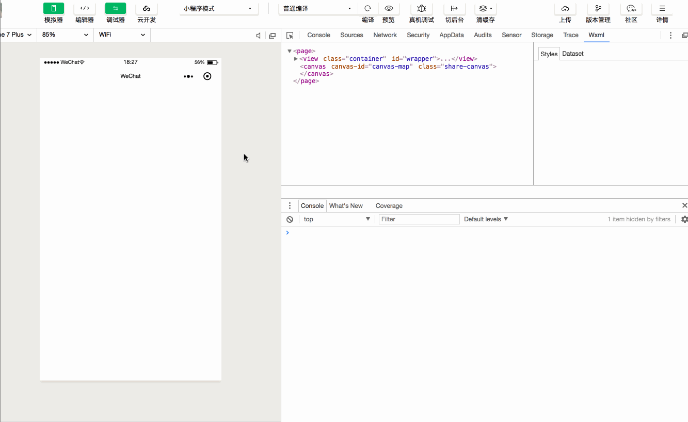

### wxml2canvas

#### Why

某些场景需要通过 canvas 绘制一些图片， 其中包含一些文字、可能的二维码等等。
然后实现时如果完全手动的去定位元素在 canvas 中的位置，结果就会产生大量不能复用和难以维护的代码。

#### How to use

引入 utils 目录下 [utils/wxml2canvas.js](./utils/wxml2canvas.js) 文件， 这个 repo 本身就是一个简单的示例， 调整一些配置项可以在开发者工具中打开。

###### wxml

```html
<!-- 
  1. wrapper id
  2. 需要绘制的元素 className
  3. 如果是文本，需要给元素添加加 data-text 属性 
 -->
<view class="container" id="wrapper">
  <text class="title draw" data-text="Hello there">Hello there</text>
  <text class="info draw" data-text="小程序是一种新的开放能力，开发者可以快速地开发一个小程序。">
   小程序是一种新的开放能力，开发者可以快速地开发一个小程序。
  </text>
  <view class="image-wrapper draw">
    <image class="draw" src="../../assets/demo.jpg"/>
  </view>
  
  <button class="generate-btn" bindtap="drawCanvas">generate</button>
</view>
<canvas canvas-id="canvas-map" class="share-canvas"></canvas>

```

###### wxss
```css

.container {
  height: 100%;
  box-sizing: border-box;
  padding: 10px 20px;
  display: flex;
  flex-direction: column;
 
} 
.container .title {
  font-size:36px;
  text-align: left;
  margin-bottom: 10px;

}
.container .info {
  font-size: 14px;
  line-height: 18px;
  color: grey;
  text-align: left;
  margin-bottom: 40px;
}
.container .image-wrapper image {
  width: 100%;
}
```

###### js
```js
Page({
  drawCanvas: function() {
    const wrapperId = '#wrapper'
    const drawClassName = '.draw'
    const canvasId = 'canvas-map'
    
    wxml2canvas(wrapperId, drawClassName, canvasId).then(() => {
      // canvas has been drawn here, you can save the canvas image with wx.canvasToTempFilePath 
    })
  }
})
```


#### Demo

--------------



#### 实现

方式主要是使用小程序提供的接口 wx.createSelectorQuery() 来获取节点信息， 然后进一步处理绘制到 canvas 上。目前仅覆盖一些简单的使用场景，支持基础的 position，font-size, color, image, border-radius, background-color 等， 🌟🌟

至于复杂的情况，Maybe you can get some inspiration from https://github.com/niklasvh/html2canvas 


#### Todo

* [ ] 区分中英文文本的换行


